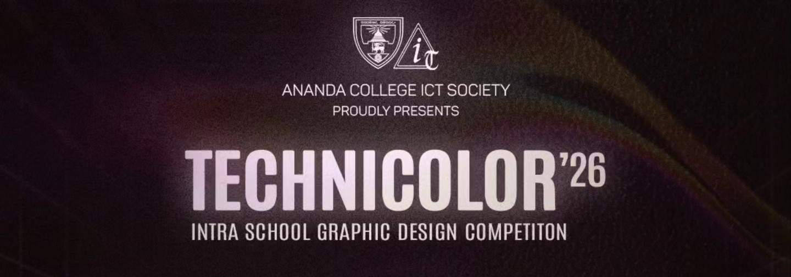

.png)

<h1 align="center">Hi, I'm Sinura Perera</h1>
<h3 align="center">Full Stack Web Developer in Sri Lanka. Passionate about Web Developement, Graphic Design, AI, ML, Arduino, and Cybersecurity.</h3>

-  I’m currently studying at **Ananda College, Colombo 10**

-  I'm passionate about **Web Developement, Graphic Design, AI/ML, Arduino and Cybersecurity**

-  How to reach me **sinuradperera@gmail.com**

-  Check my portfolio **[https://sinuradperera.vercel.app](https://sinuradperera.vercel.app)**

<h3 align="left">Connect with me:</h3>

###

  

###

 
<h3 align="left">Languages and Tools:</h3>
<table align="center" width="100%">
  <tr>
    <td align="center">
      
    </td>
    <td align="center">
      
    </td>
    <td align="center">
      
    </td>
    <td align="center">
      
    </td>
    <td align="center">
      
    </td>
    <td align="center">
      
    </td>
  </tr>
  <tr>
    <td align="center">
      
    </td>
    <td align="center">
      
    </td>
    <td align="center">
      
    </td>
    <td align="center">
      
    </td>
    <td align="center">
      
    </td>
    <td align="center">
      
    </td>
  </tr>
  <tr>
    <td align="center">
      
    </td>
    <td align="center">
      
    </td>
    <td align="center">
      
    <td align="center">
      
    </td>
    <td align="center">
      
    </td>
  </tr>
</table>

###

   
   
   

   <i><b><h2>Champion of the Bits 25', Tecnicolor 26' - Photo Manipulation organized by the ACICTS and 2nd Runners Up of HyperTXT' 26 oraganized by ACICTS</h2></b></i>
###

                     
